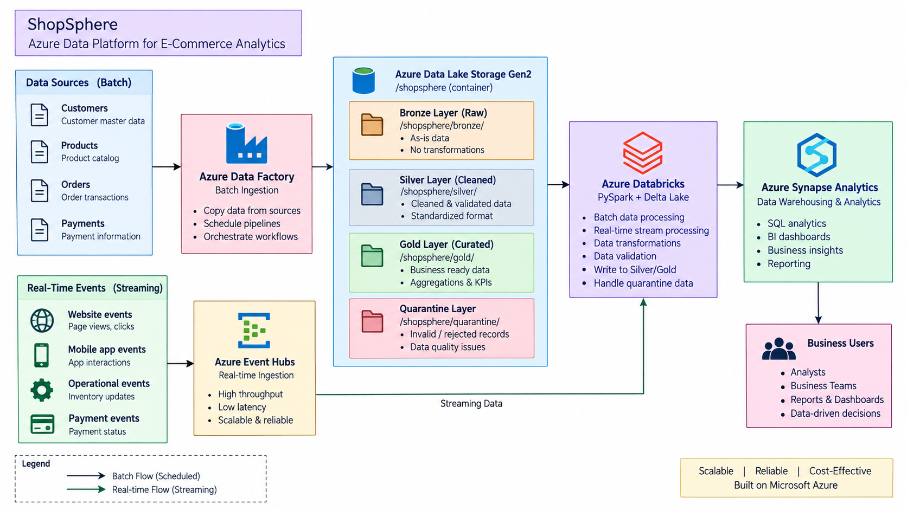

# ShopSphere — Azure Data Engineering Platform

> An end-to-end Azure data engineering project for processing e-commerce data using batch and real-time data pipelines.

## 📌 Project Overview

**ShopSphere** is a production-style e-commerce data platform built on Microsoft Azure.

The goal of this project is to design and implement an end-to-end data engineering solution that ingests data from multiple sources, stores it in a scalable data lake, transforms and validates the data, and produces business-ready datasets for analytics.

The platform will support both **batch processing** and **real-time data processing**.

---

## 🎯 Business Problem

An e-commerce company generates large volumes of data from customers, products, orders, and payments.

This data comes from different sources and needs to be:

- Ingested reliably
- Stored centrally
- Cleaned and validated
- Processed efficiently
- Available for analytical workloads
- Monitored for failures and data-quality issues

The objective of ShopSphere is to build a scalable Azure-based data platform that addresses these requirements.

---

## 🎯 Project Objectives

- Build an end-to-end Azure Data Engineering platform
- Implement a scalable data lake using **Azure Data Lake Storage Gen2**
- Build automated data ingestion pipelines using **Azure Data Factory**
- Implement **Bronze, Silver, and Gold** data layers
- Process large datasets using **Azure Databricks and PySpark**
- Implement **Delta Lake** for reliable data storage
- Support incremental data processing
- Implement data-quality validation and error handling
- Implement real-time data ingestion using **Azure Event Hubs**
- Build analytical datasets using **Azure Synapse Analytics**
- Implement monitoring and pipeline failure handling
- Implement source control and CI/CD practices

---

## 🏗️ Architecture

 

> The architecture will be updated as each component is implemented.

---

## 🛠️ Technology Stack

| Technology | Purpose |
|---|---|
| Azure Data Factory | Data ingestion and pipeline orchestration |
| Azure Data Lake Storage Gen2 | Centralized cloud data lake |
| Azure Databricks | Data processing and transformation |
| Apache Spark / PySpark | Distributed data processing |
| Delta Lake | Reliable storage and ACID transactions |
| Azure Event Hubs | Real-time event ingestion |
| Azure Synapse Analytics | Analytical data serving |
| Power BI | Data visualization and reporting |
| Git / GitHub | Source control and version management |

---

## 📊 Data Domains

The project will work with four primary data domains:

### Customers

Customer profile and registration information.

### Products

Product, category, brand, price, and cost information.

### Orders

Customer orders, products purchased, quantities, discounts, and order status.

### Payments

Payment transactions, payment methods, amounts, and payment status.

---

## 🗂️ Data Lake Architecture

The data lake follows a **Medallion Architecture**.

```text
ADLS Gen2
│
├── bronze/
│   ├── customers/
│   ├── products/
│   ├── orders/
│   └── payments/
│
├── silver/
│   ├── customers/
│   ├── products/
│   ├── orders/
│   └── payments/
│
├── gold/
|    ├── customer_summary/
|    |── sales_summary/
|    |── product_summary/
│
└── quarantine/
    ├── customers/
    ├── products/
    ├── orders/
    └── payments/
```

### Bronze Layer

Stores raw data received from source systems with minimal transformation.

### Silver Layer

Contains cleaned, validated, standardized, and deduplicated data.

### Gold Layer

Contains business-ready datasets optimized for analytical use cases.

### Quarantine Layer

Stores invalid or rejected records for investigation instead of silently discarding them.

---

## 🔄 Batch Data Flow

The planned batch pipeline:

```text
Source Systems
      ↓
Azure Data Factory
      ↓
ADLS Gen2 — Bronze
      ↓
Azure Databricks
      ↓
Data Quality & Transformation
      ↓
Silver
      ↓
Business Transformations
      ↓
Gold
      ↓
Azure Synapse Analytics
```

---

## ⚡ Real-Time Data Flow

The planned real-time pipeline:

```text
Transaction Events
       ↓
Azure Event Hubs
       ↓
Azure Databricks
       ↓
Structured Streaming
       ↓
Delta Lake
       ↓
Gold Layer
       ↓
Analytics
```

---

## 🧪 Data Quality

The platform will implement data-quality checks including:

- Null-value validation
- Duplicate detection
- Data-type validation
- Invalid business values
- Referential integrity
- Schema validation
- Invalid record handling

Records that fail validation will be moved to the **Quarantine** layer.

---

## 📈 Planned Business Metrics

The final platform will support analytics such as:

- Total revenue
- Total orders
- Average order value
- Revenue by category
- Revenue by location
- Top-selling products
- Top customers
- Payment success/failure rates
- Cancelled orders
- Suspicious transactions

---

## 📁 Repository Structure

```text
azure-ecommerce-data-platform/
│
├── README.md
│
├── architecture/
│   └── architecture.png
│
├── adf/
│   ├── pipelines/
│   ├── datasets/
│   └── linked-services/
│
├── databricks/
│   ├── bronze/
│   ├── silver/
│   ├── gold/
│   └── streaming/
│
├── sql/
│   ├── ddl/
│   ├── views/
│   └── procedures/
│
├── scripts/
│   └── data_generator/
│
├── tests/
│
└── docs/
    ├── data_dictionary.md
    ├── data_quality.md
    └── design_decisions.md
```

---
## 🚧 Project Status

**Status:** In Development

### ✅ Completed

- Project requirements and business use cases
- GitHub repository setup
- Initial architecture design
- Azure Data Lake Storage Gen2 setup
- Azure Data Factory setup
- ADLS Gen2 Bronze layer structure
- Bronze data ingestion for:
  - Customers
  - Products
  - Orders
  - Payments
- Silver layer transformation and cleansing for all four domains
- Curated Silver datasets for:
  - Customers
  - Products
  - Orders
  - Payments
- Gold Customer Summary dataset
- Gold Customer Summary Data Flow
- Gold Customer Summary pipeline
- Successful pipeline execution and output verification
- Gold Sales Summary dataset
- Gold Sales Summary Data Flow
- Gold Sales Summary pipeline
- Successful Gold Sales Summary execution and output verification
- Gold Product Summary dataset
- Gold Product Summary Data Flow
- Gold Product Summary pipeline
- Successful Gold Product Summary execution and output verification

### 🔄 In Progress

- Gold business datasets and analytical transformations
- Additional business metrics and aggregations

### 📋 Planned

- Azure Databricks and PySpark processing
- Delta Lake implementation
- Incremental data processing
- Data-quality framework and quarantine handling
- Azure Event Hubs real-time ingestion
- Structured Streaming
- Azure Synapse Analytics
- Power BI dashboards
- Monitoring and alerting
- CI/CD implementation
